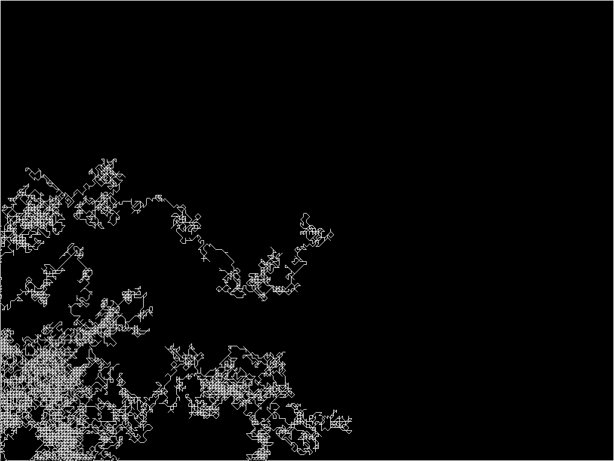

#About Random Walker

### Description

The random walker is a point that moves a step every few frames in a random
direction. The position of the walker is represented by a black circle
drawn on a FBO in order to be able to store its path.
