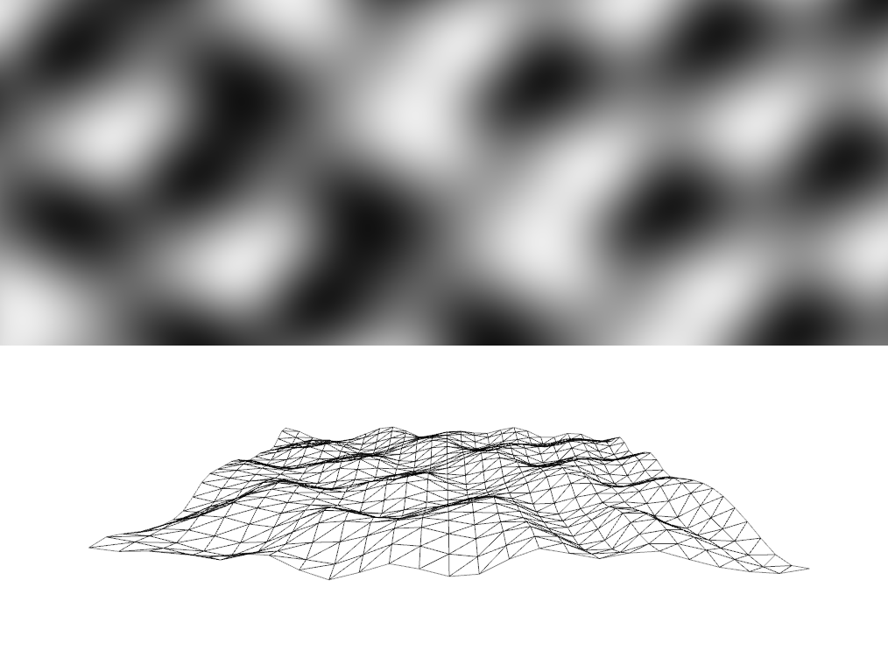

#About 2D Perlin noise

### Description

In this exercise, a shader is to compute the position of the vertices
of a ofPlanePrimitive according to the Perlin noise stored in a texture.
The viewing window contains the noise texture as well as the distorted plane.
The same keyboard shortcuts can be used to control the noise pattern. Also,
the mouse can be used to rotate/move the plane.

Since this is based on the previous exercise, the same keyboard shortcuts can
be used to modify the generation of the Perlin noise and thus, the landscape.

