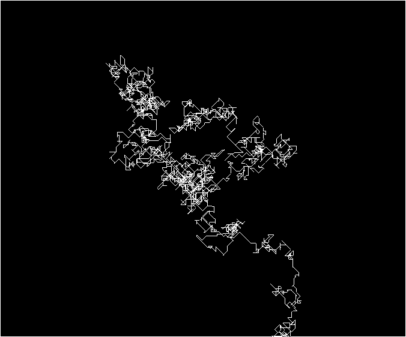

#About Levy Flight with Exponential Distribution

### Description

Random walks are a mathematical formalization of a path that is formed
by taking a succession of random steps, in 1, 2, or multiple dimensions.

It has multiple applications, such as simplified models for Brownian motion.

They can be modelled as a special case of Markov Chains.

An interesting application of random walks are random walks on graphs and
self interacting random walks.

A Levy flight is a random walk in which the step-lenghts have a probability
distribution that is heavy-tailed (it's "tail" is "heavier" (lower) than
the tail of the exponential distribution).

Levy flights can be used to optimize the search for randomly spread items,
since it combines the regular random walk (Brownian motion) with long distance
jumps. Indeed, it has been theorized that the motion of animals such as sharks
while searching for prey follows a Levy flight (Levy flight foraging
hypothesis).

In this exercise, a variation of the Levy flight is implemented that uses
an exponential distribution X squared, for X between 0 and 1.

