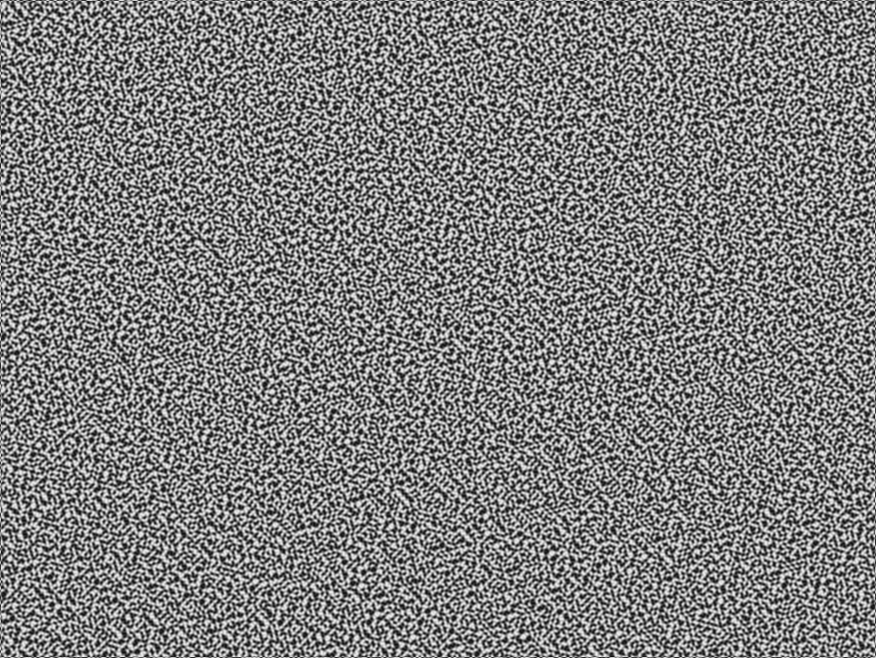

#About 2D Perlin noise

### Description

This is a simple 2D generation of Perlin noise.

The Perlin noise, named after Ken Perlin, was created for procedurally
generating realistic textures, as shown in his paper, "An image syntesizer"
(Perlin, 1985).

The main goal of the perlin noise is to create a smooth randomness (i.e.
to be random, but to avoid abrupt changes). The basic algorithm for 2D Perlin
noise (alhough it can easlily be implemented in any space) is:

- Define a lattice of points and add to each point a random vector.
- For a given point, find the 4 closest lattice points to it and find distance
vectors to those points.
- Interpolate the dot product of the distance vector with the gradient vector
with the position of the point with respect to those 4 lattice points. The
actual interpolation type (linear, cubic, etc) affects the final result.

For more details, the Ken Perlin's paper can be found at:
https://design.osu.edu/carlson/history/PDFs/p287-perlin.pdf

In this exercise, the openFrameworks function ofNoise will be used to generate
a black and white image where the luminosity of the image varies according to
a 2D Perlin noise. Moreover, the X and Y offsets of the noise can be controlled
using the arrow keys and the noise size can be controlled using the + and -
keys.

This also concludes exercise 1.9.

The actual implementation uses a shader to compute the position of the vertices
of a ofPlanePrimitive according to the Perlin noise stored in a texture.
The viewing window contains the noise texture as well as the distorted plane.
The same keyboard shortcuts can be used to control the noise pattern. Also,
the mouse can be used to rotate/move the plane.

