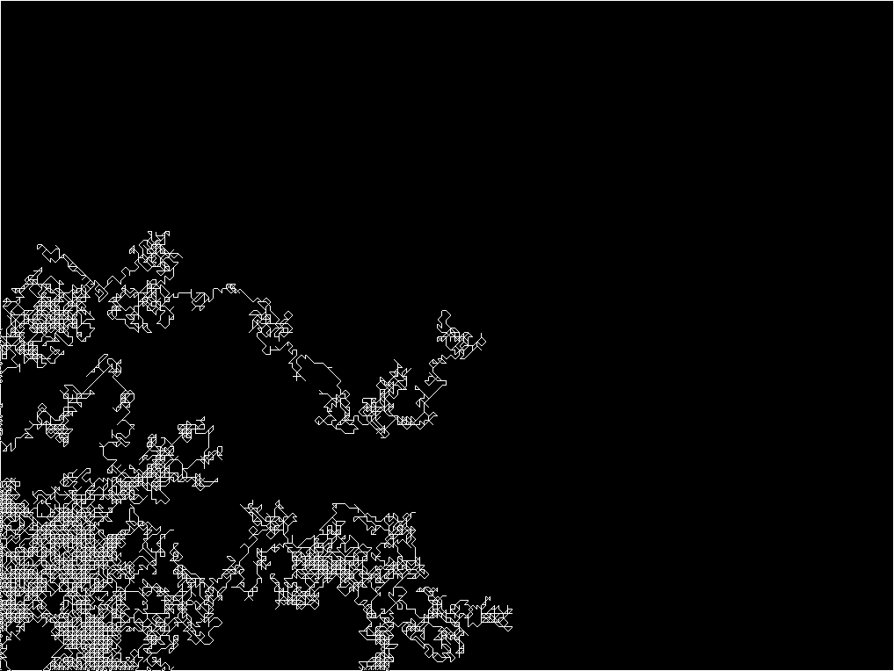

#About Random Walker

### Description

This is a refactor of the random walker to use vectors.

It works by having a unit vector for each direction, multiply that with
the step size (speed) to get the velocity and add the velocity to the position
to get the new position.

