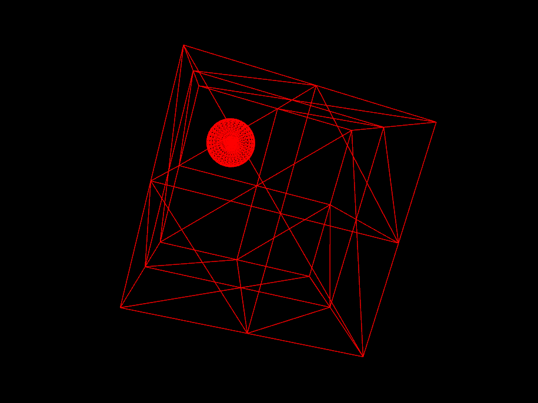

#About Random Walker

### Description

A bouncing sphere that bounces in a 3D box. The movement of the spehere is
defined according to a velocity vector randomly initialized, which changes
a direction when a wall of the box it hit.

In order to better visualise the sphere, a easy cam is used.

There are some known issues, such as:

- The collision check is done using the position of the sphere (more precisely,
the position of the center of the sphere), not the edges of the sphere.
- If a collision has occured, the velocity on that axis is reversed. However,
the position after the frame that contained the collision is not computed.
