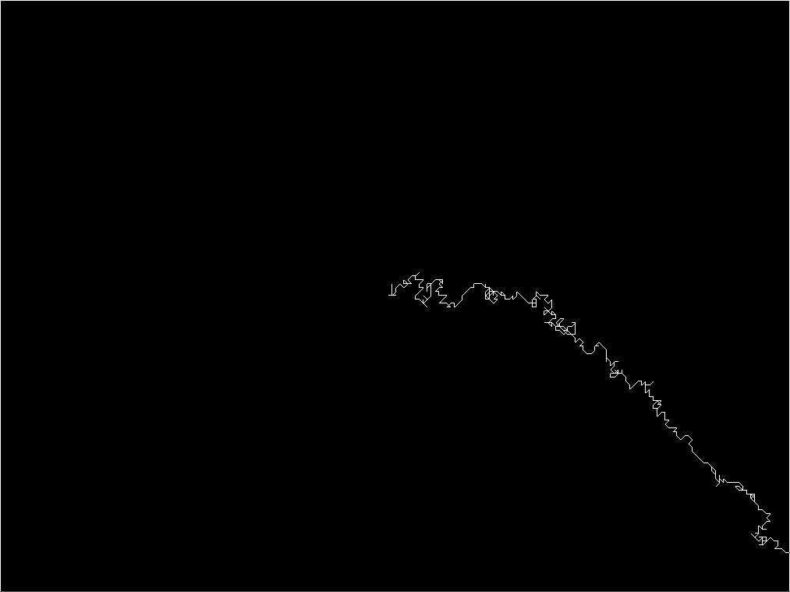

#About Biased Random Walker Guided by Mouse

### Description

The random walker is a point that moves a step every few frames in a biased
random direction, with a greater probability to choose the direction of the
mouse. The position of the walker is represented by a black circle drawn on
a FBO in order to be able to store its path.

### Known bugs

The current implementation has some issues:

* Does not use all the movement directions (uses only up, down, left and
  right).
* Due to a computational issue related to the way the angle is computed,
the down direction is not computed properly (the function used to compute the
angle of the mouse vector with respect to the X axis returns angles in
interval [0, 180), not [0, 360) as previously thought).

The bug was not fixed since the example has fullfiled its purpose.
