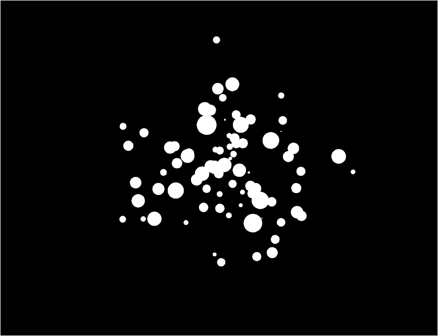

#About Paint Splatter Generator

### Description

Generates paint splatters using 3 natural (Gaussian) distributions: one
for x position, one for y position and one for splatter size.

Currently, the number of paint splatters is hardcoded, as well as the
parameters of the distributions that generate them.

### Improvements

As a possible improvment, the distribution that generates their sizes should
take into account the distance from the center such that particles that ar
further from the center of the splatter should be smaller on average
(maybe set the mean of the distribution to the distance from the center of the
when generating the size of each particle?).

